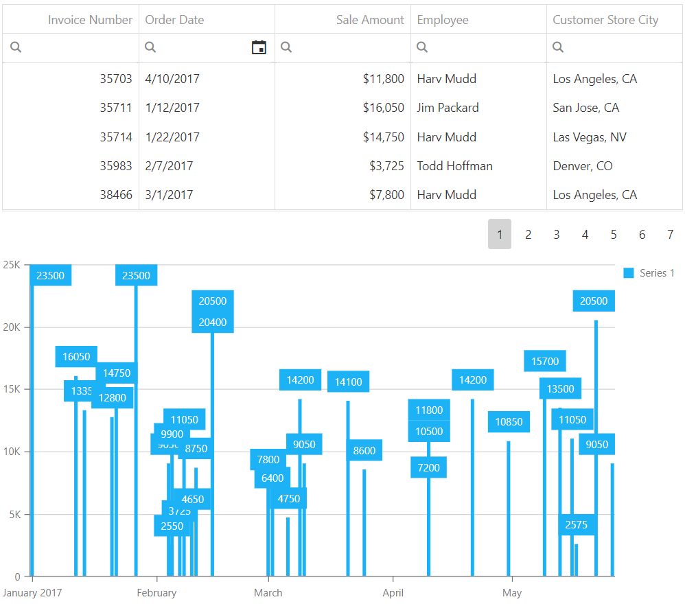

<!-- default badges list -->

<!-- default badges end -->
# DataGrid for DevExtreme - How to filter Chart's series based on a grid's filter

This example illustrates how to filter Сhart's series based on the grid's filter. For this, we handle the grid's [onOptionChanged](https://js.devexpress.com/Documentation/ApiReference/UI_Widgets/dxDataGrid/Configuration/#onOptionChanged) event, obtain the grid's filter by calling the [getCombinedFilter(returnDataField)](https://js.devexpress.com/Documentation/ApiReference/UI_Widgets/dxDataGrid/Methods/#getCombinedFilterreturnDataField) method and apply this filter to the underlying datasource to evaluate and set the chart's [dataSource](https://js.devexpress.com/Documentation/ApiReference/Data_Visualization_Widgets/dxChart/Configuration/#dataSource). We use [Query Concept](https://js.devexpress.com/Documentation/Guide/Data_Layer/Data_Layer/#Query_Concept) to evaluate the filter expression.

## Files to Review

- **Angular**
    - [app.component.html](angular/src/app/app.component.html)
    - [app.component.ts](angular/src/app/app.component.ts)
- **jQuery**
    - [index.js](jquery/index.html)
- **React**
    - [App.js](react/src/App.js)
- **Vue**
    - [App.vue](vue/src/App.vue)

## Documentation

- [Getting Started with DataGrid](https://js.devexpress.com/Documentation/Guide/UI_Components/DataGrid/Getting_Started_with_DataGrid/)

- [DataGrid - API Reference](https://js.devexpress.com/Documentation/ApiReference/UI_Components/dxDataGrid/)

- [Chart - API Reference](https://js.devexpress.com/Documentation/ApiReference/UI_Components/dxChart/)
<!-- feedback -->
## Does this example address your development requirements/objectives?

 

(you will be redirected to DevExpress.com to submit your response)
<!-- feedback end -->
